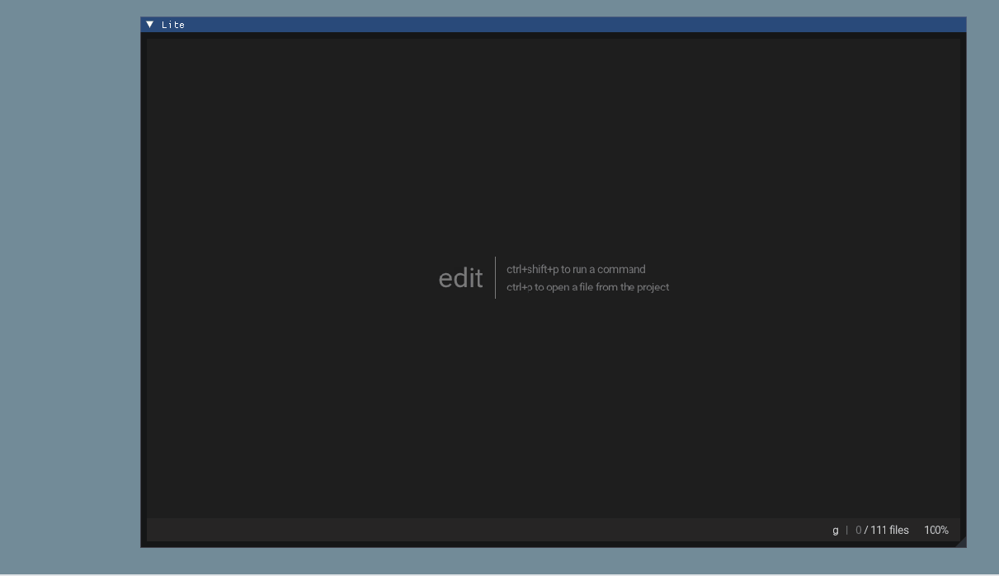

# ImLite

An embeddable Lite for Dear ImGui
[ImLite](https://github.com/cstom4994/ImLite)

## Overview
[Lite](https://github.com/rxi/lite) is a lightweight text editor written mostly in Lua — it aims to provide something practical, pretty, small and fast, implemented as simply as possible; easy to modify and extend, or to use without doing either.

Lite itself can render the screen as a bitmap, which makes it possible to embed it into ImGui. (Just using ImGui::Image)

## Notice
So far, ImLite only implements the rendering of the glfw opengl3 backend :(

The code is very messy and has predictable memory leaks

## Demo
Use xmake to compile and view example directly

## Links
[Lite](https://github.com/rxi/lite)
[FWK](https://github.com/r-lyeh/FWK)
[ImGui](https://github.com/ocornut/imgui)